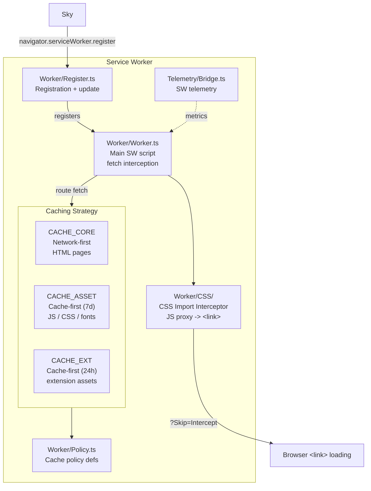

# Worker: Service Worker 🍩

This document describes `Worker`, the service worker for `Land`.

- `Worker` implements asset caching and offline support.
- It implements a dynamic CSS loading strategy.
- It intercepts JS imports of CSS files.
- It responds with JS modules that trigger `<link>` tag loading.

---

## Table of Contents

1. [Overview](#overview)
2. [Architecture](#architecture)
3. [Caching Strategy](#caching-strategy)
4. [Dynamic CSS Loading](#dynamic-css-loading)
5. [Service Worker Lifecycle](#service-worker-lifecycle)
6. [Client Scripts](#client-scripts)
7. [Related Documentation](#related-documentation)

---



## Overview 📋

`Worker` is a standalone service worker script with no runtime dependencies.

- It provides caching for `Land`'s UI assets.
- It implements a custom CSS import interceptor.
- It is registered by `Sky` at application startup.

| Attribute    | Value                                  |
| ------------ | -------------------------------------- |
| Language     | `TypeScript` (compiled via `ESBuild`)  |
| Runtime      | `ServiceWorker` API (browser built-in) |
| Dependencies | None (zero runtime deps)               |
| Consumed by  | `Sky` (registered at startup)          |

---

## Architecture 🏗️

```
+------------------------------------------------------------------+
|                       Worker                                      |
|                                                                   |
|  +------------------+  +------------------+  +------------------+ |
|  | Worker/Worker.ts |  | Worker/CSS/      |  | Worker/Policy.ts | |
|  | Main SW script   |  | CSS interceptor  |  | Cache policy     | |
|  |                  |  | module           |  | definitions      | |
|  +------------------+  +------------------+  +------------------+ |
|                                                                   |
|  +------------------+  +------------------+                       |
|  | Worker/Register  |  | Telemetry/Bridge |                       |
|  | .ts              |  | .ts              |                       |
|  | Registration     |  | SW telemetry     |                       |
|  | and update mgmt  |  | bridge           |                       |
|  +------------------+  +------------------+                       |
+------------------------------------------------------------------+
```

### Module Map 🗺️

| Path                         | Purpose                            |
| ---------------------------- | ---------------------------------- |
| `Source/Worker/Worker.ts`    | Main service worker script         |
| `Source/Worker/CSS/`         | Dynamic CSS loading module         |
| `Source/Worker/Policy.ts`    | Cache policy definitions           |
| `Source/Worker/Register.ts`  | Registration and update management |
| `Source/Telemetry/Bridge.ts` | Service worker telemetry bridge    |

---

## Caching Strategy 💾

`Worker` implements a multi-tier caching strategy for different resource types.

### Cache Categories

| Cache Name    | Strategy      | Resources                                   | Duration |
| ------------- | ------------- | ------------------------------------------- | -------- |
| `CACHE_CORE`  | Network-first | Navigation requests (HTML pages, app shell) | Session  |
| `CACHE_ASSET` | Cache-first   | Static assets (JS, CSS, fonts, images)      | 7 days   |
| `CACHE_EXT`   | Cache-first   | Extension assets                            | 24 hours |
| (none)        | Network-only  | External resources (CDN, API calls)         | N/A      |

### Network-First Strategy (CACHE_CORE)

```
Request navigation (HTML)
    |
    v
1. Try network fetch
    |
    +---> Network succeeds:
    |       - Return response to page
    |       - Cache response in CACHE_CORE
    |       - Done
    |
    +---> Network fails:
            - Check CACHE_CORE for cached response
            - Return cached response if available
            - Return fallback page if not cached
```

### Cache-First Strategy (CACHE_ASSET)

```
Request static asset (JS, CSS)
    |
    v
1. Check CACHE_ASSET for cached response
    |
    +---> Cache hit:
    |       - Return cached response
    |       - Background-fetch update (stale-while-revalidate)
    |       - Update cache if newer version available
    |
    +---> Cache miss:
            - Fetch from network
            - Cache response in CACHE_ASSET
            - Return response
```

---

## Dynamic CSS Loading 🎨

`Worker` implements a unique CSS loading strategy: JavaScript modules that
`import 'styles.css'` are intercepted and served a JS proxy that injects a
`<link>` element.

### CSS Import Interception

```
JavaScript module imports CSS
  import './styles.css';     // At module scope
    |
    v
Worker intercepts fetch for styles.css
    |
    +---> Detects CSS import (MIME type or path pattern)
    |
    +---> Returns generated JS module:
    |
    |   // Generated by Worker:
    |   const link = document.createElement('link');
    |   link.rel = 'stylesheet';
    |   link.href = './styles.css?Skip=Intercept';
    |   document.head.appendChild(link);
    |   export default link;
    |
    v
Page receives JS module, not CSS
    |
    v
CSS loads via native browser <link> element
```

### Two-Phase Loading

To avoid infinite interception (where `Worker` intercepts the CSS URL, returns
JS, JS triggers a new CSS fetch that gets intercepted again), `Worker` uses a
`?Skip=Intercept` query parameter:

```
Phase 1: JS module import('styles.css')
    -> Worker intercepts
    -> Returns JS proxy module
    -> JS proxy creates <link href="styles.css?Skip=Intercept">

Phase 2: Browser loads styles.css?Skip=Intercept
    -> Worker checks for Skip=Intercept parameter
    -> Passes through to network (no interception)
    -> Returns actual CSS content
    -> <link> element loads CSS natively
```

### Benefits

| Aspect      | Without Worker                  | With Worker                     |
| ----------- | ------------------------------- | ------------------------------- |
| CSS loading | Imported as JS string in bundle | Native browser `<link>` loading |
| CSS cascade | Bundle-dependent ordering       | Proper cascade via DOM order    |
| Source maps | Lost during JS bundling         | Preserved via native loading    |
| Hot reload  | Requires full rebuild           | Works with CSS-only refresh     |

---

## Service Worker Lifecycle 🔄

### Installation

```
1. Sky registers Worker:
    navigator.serviceWorker.register('/worker.js', { scope: '/' })
    |
    v
2. Worker install event fires:
    - Caches critical assets in CACHE_CORE
    - Pre-caches known workbench bundles
    - Installs CSS interceptor module
    |
    v
3. Worker enters waiting state (if existing SW active)
```

### Activation

```
4. Sky sends activation signal via postMessage:
    worker.postMessage({ type: 'ACTIVATE' })
    |
    v
5. Worker activate event fires:
    - Claims all uncontrolled clients
    - Clears old caches (version mismatch)
    - Begins intercepting fetch events
    - Sends 'activated' response to Sky
```

### Update Cycle

```
6. Sky checks for Worker update periodically:
    navigator.serviceWorker.register('/worker.js')
    |
    v
7. New Worker detected (byte-different script):
    - New Worker installs in background
    - New Worker enters waiting state
    |
    v
8. Sky decides when to activate:
    - Immediately (during development)
    - On next navigation (during production)
    - User prompt (configurable)
    |
    v
9. New Worker activates:
    - Takes over from old Worker
    - Fresh caches, updated interceptors
    - Old caches deleted
```

---

## Client Scripts 📜

`Worker` provides client-side scripts for integration.

### Register.ts

Handles service worker registration and update management:

```typescript
export async function registerWorker(): Promise<ServiceWorkerRegistration> {
	const registration = await navigator.serviceWorker.register("/worker.js", {
		scope: "/",
	});

	// Check for updates on every page load
	registration.addEventListener("updatefound", () => {
		const newWorker = registration.installing;
		if (newWorker) {
			newWorker.addEventListener("statechange", () => {
				if (newWorker.state === "installed") {
					// New worker ready, notify Sky
					dispatchWorkerUpdate();
				}
			});
		}
	});

	return registration;
}
```

---

## Related Documentation 📚

- [Sky](https://github.com/CodeEditorLand/Sky/tree/Current/Documentation/GitHub/Architecture.md) -
  UI layer (`Worker` consumer)
- [Wind](https://github.com/CodeEditorLand/Wind/tree/Current/Documentation/GitHub/Architecture.md) -
  Service layer (`Worker` integration)
- [BuildPipeline](https://github.com/CodeEditorLand/Land/tree/Current/Documentation/GitHub/BuildPipeline.md) -
  Build pipeline
- [Polyfills](https://github.com/CodeEditorLand/Land/tree/Current/Documentation/GitHub/Polyfills.md) -
  Polyfill layers

---

**Project Maintainers:** Source Open
([Source/Open@Editor.Land](mailto:Source/Open@Editor.Land)) |
[GitHub Repository](https://github.com/CodeEditorLand/Worker) |
[Report an Issue](https://github.com/CodeEditorLand/Worker/issues)
