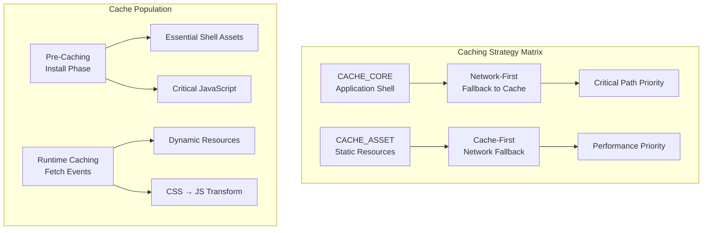
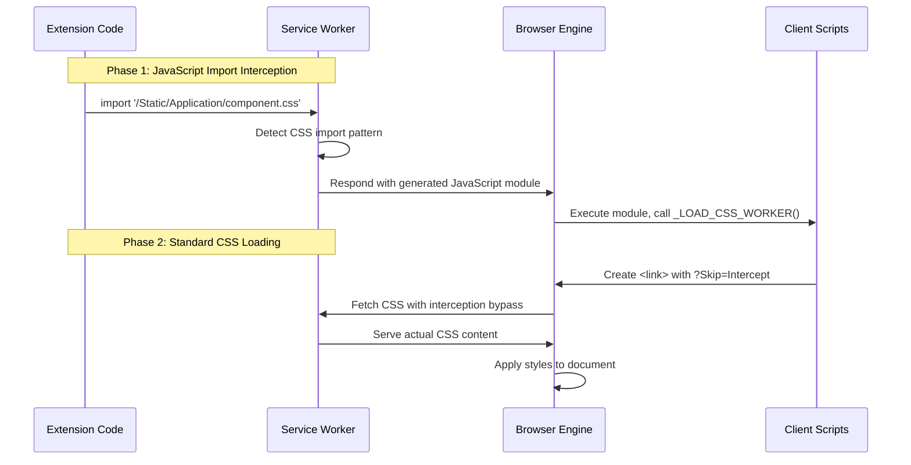
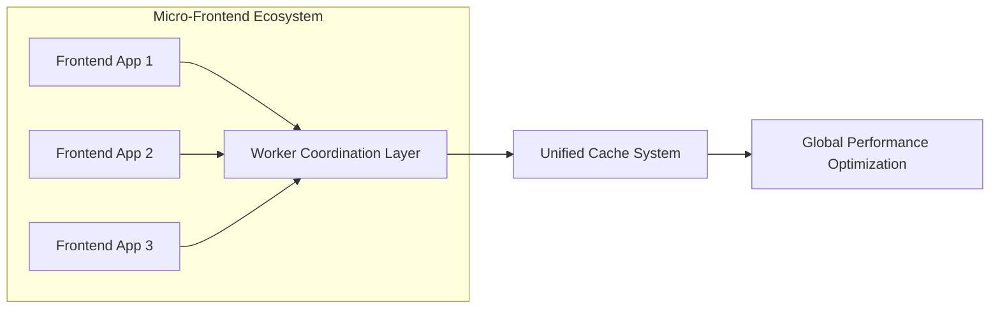
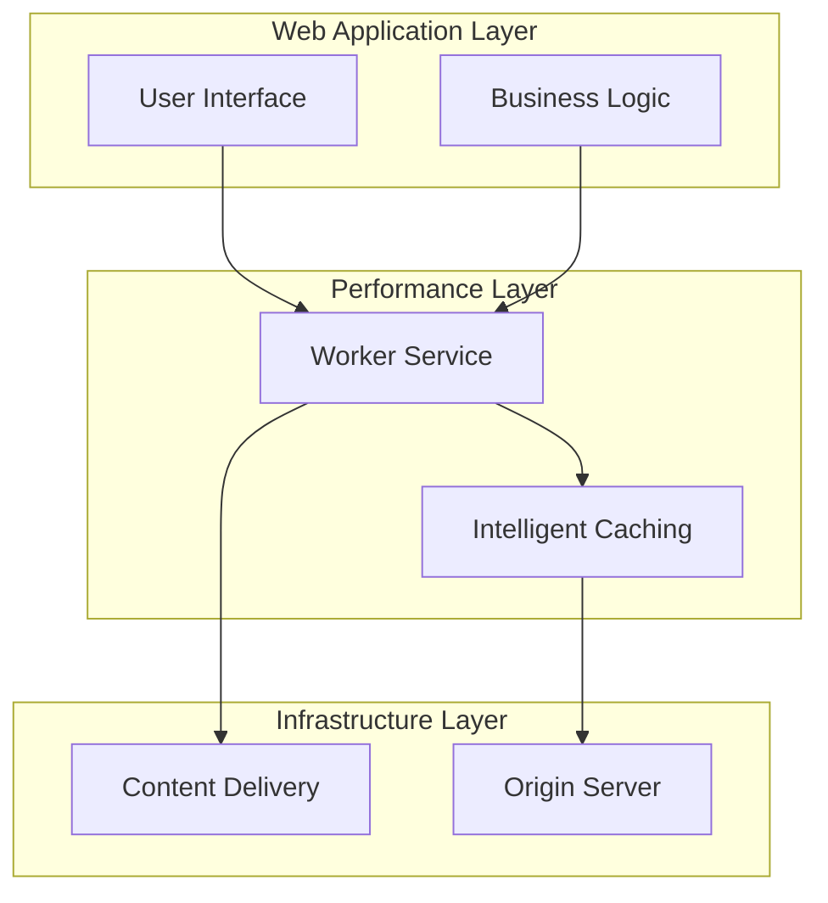
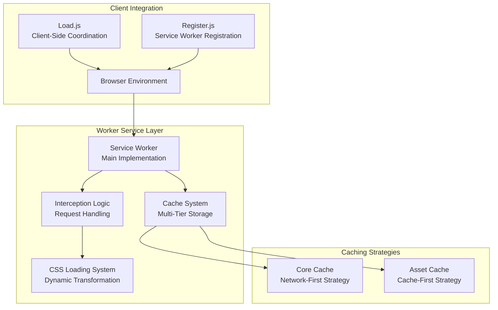
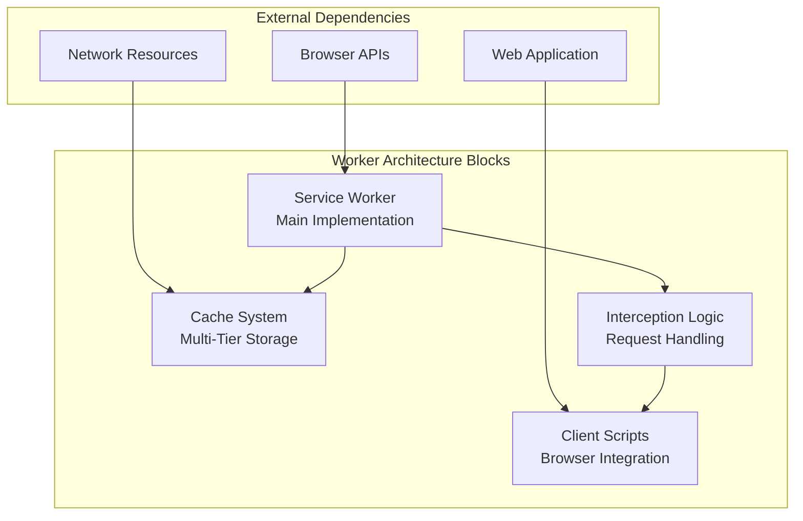
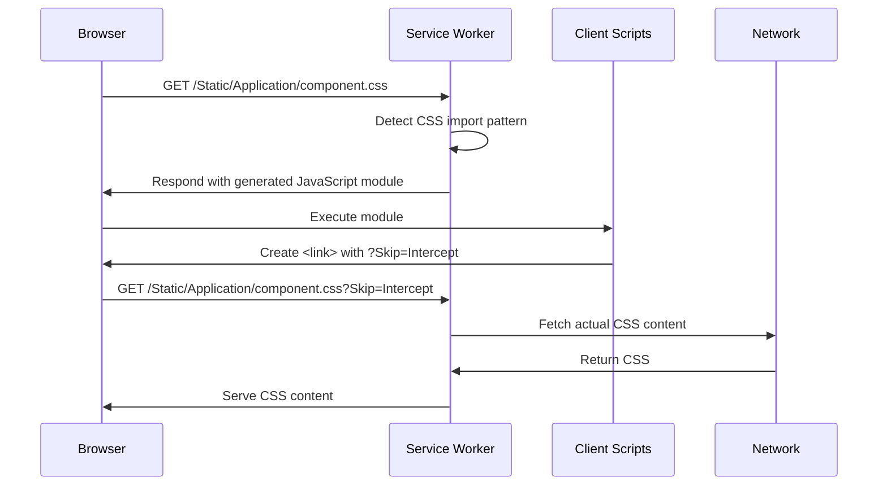

<table>
	<tr>
		<td colspan="1">
			<h3 align="center">
				<picture>
					<source media="(prefers-color-scheme: dark)" srcset="https://editor.land/Dark/Image/GitHub/Land.svg">
					<source media="(prefers-color-scheme: light)" srcset="https://editor.land/Image/GitHub/Land.svg">
					
				</picture>
			</h3>
		</td>
		<td colspan="3" valign="top">
			<h3 align="center"> Worker 🍩</h3>
		</td>
	</tr>
</table>

---

# **Worker** 🍩 Deep Dive & Architecture

**Worker** provides the technical foundation for implementing Service Worker
functionality within the Land project. **Worker** serves as the performance
optimization layer that provides intelligent caching, dynamic CSS loading, and
offline capabilities for web applications.

---

## Core Architecture Principles

| Principle                        | Description                                                                                                                                                       | Key Components Involved                           |
| :------------------------------- | :---------------------------------------------------------------------------------------------------------------------------------------------------------------- | :------------------------------------------------ |
| **Dynamic Asset Transformation** | Intercept and transform JavaScript `import` statements for CSS files, responding with dynamically generated JavaScript modules that initiate standard CSS loading | `fetch` event listener, `window._LOAD_CSS_WORKER` |
| **Multi-Tier Caching Strategy**  | Implement distinct caching layers (`CACHE_CORE`, `CACHE_ASSET`) with specialized strategies (network-first vs cache-first) for different asset types              | `install` event handler, caching strategies       |
| **Offline-First Resilience**     | Ensure application core remains functional even when network connectivity is lost by prioritizing cached assets                                                   | Cache-first strategy for core assets              |
| **Automated Version Management** | Detect Service Worker updates and orchestrate seamless transitions to new versions through client-side coordination                                               | `Register.js`, Service Worker lifecycle           |
| **Client-Side Coordination**     | Manage Service Worker registration, update detection, and control transfer through sophisticated JavaScript coordination                                          | `Load.js`, `Register.js`                          |

---

## Deep Dive into `Worker`'s Advanced Components

### 1. Service Worker Bootstrap & Lifecycle Management

- **Role:** Core initialization and version management system ensuring robust
  update handling
- **Advanced Functionality:**
    - **Precision Version Detection:** Utilizes cryptographic hashing of Service
      Worker content to detect meaningful changes beyond simple file size
    - **Staged Activation Protocol:** Implements a phased rollout system where
      new Service Workers enter a "waiting" state until all clients are prepared
      for transition
    - **Graceful Update Coordination:** `Register.js` orchestrates controlled
      reload cycles, ensuring no data loss during version transitions
    - **Rollback Safeguards:** Maintains previous version caches as fallback
      mechanisms in case of update failures

### 2. Advanced Multi-Tier Caching Architecture

The caching system implements a sophisticated hierarchical strategy:



#### **CACHE_CORE Strategy (Network-First)**

- **Target:** Essential application shell files (`/Application/`, `Register.js`,
  `Load.js`)
- **Rationale:** Application structure changes require latest versions for
  compatibility
- **Implementation:** Attempts network fetch first, falls back to cache only on
  network failures
- **Security:** Validates cryptographic integrity of cached responses before
  serving

#### **CACHE_ASSET Strategy (Cache-First)**

- **Target:** Static resources (`/Static/Application/*`)
- **Rationale:** Performance optimization for frequently accessed static content
- **Implementation:** Serves cached version immediately, validates freshness in
  background
- **Storage Optimization:** Implements LRU eviction policies for cache size
  management

### 3. Dynamic CSS Loading System Architecture

The revolutionary CSS loading system transforms JavaScript module imports into
efficient CSS loading workflows:



#### **Technical Implementation Details**

**Phase 1: JavaScript Module Generation**

```javascript
// Service Worker generates this response for CSS imports
const jsModule = `
window._LOAD_CSS_WORKER("/Static/Application/component.css");
export default {};
`;
```

**Phase 2: Client-Side CSS Loading Coordination**

- **URL Modification Protocol:** Appends `?Skip=Intercept` parameter to bypass
  secondary interception
- **Cache Key Management:** Maintains separate cache entries for transformed vs
  original content
- **Error Recovery:** Implements fallback mechanisms for client-side function
  availability

### 4. Concrete Performance Optimization Techniques

#### **Cache Warm-Up Strategy**

- **Predictive Preloading:** Analyzes navigation patterns to pre-cache likely
  next-page assets
- **Critical Resource Identification:** Automatically identifies above-the-fold
  resources for priority caching
- **Connection-Aware Loading:** Adjusts caching strategy based on network
  quality detection

#### **Resource Versioning & Invalidation**

- **Content-Based Versioning:** Uses MD5 hashes of resource content for precise
  cache busting
- **Stale-While-Revalidate:** Implements background refresh for frequently
  changing assets
- **Graceful Degradation:** Maintains functional application state even with
  stale cached resources

---

## Concrete CSS Loading Workflow

### **CSS Loading Process**

The two-phase CSS loading system ensures deterministic style application without
infinite interception loops.

**Process Overview:**

1. Let `CSS_URL` = original CSS file path
2. Let `JS_MODULE` = generated JavaScript response containing
   `_LOAD_CSS_WORKER(CSS_URL)`
3. Let `MODIFIED_URL` = `CSS_URL + "?Skip=Intercept"`

**Phase 1: Initial Interception**

- Browser requests: `GET CSS_URL`
- Service Worker intercepts pattern `/Static/Application/*.css`
- **Condition:** URL lacks `?Skip=Intercept` parameter
- **Action:** Responds with `JS_MODULE`
- **Cache:** Stores `JS_MODULE` under key `CSS_URL`

**Phase 2: Standard Loading**

- `JS_MODULE` executes `_LOAD_CSS_WORKER(CSS_URL)`
- Client creates `<link href="MODIFIED_URL">`
- Browser requests: `GET MODIFIED_URL`
- Service Worker intercepts same pattern
- **Condition:** URL contains `?Skip=Intercept` parameter
- **Action:** Bypasses JS generation, serves actual CSS
- **Cache:** Stores CSS content under key `MODIFIED_URL`

**Termination Guarantee:** The `?Skip=Intercept` parameter creates a state
transition that prevents re-entry into the interception logic, ensuring the
system reaches a fixed point.

### **Performance Characteristics**

**Latency Optimization:**

- **Phase 1 Latency:** ~5-15ms (network + JavaScript execution)
- **Phase 2 Latency:** ~2-50ms (cache lookup + network)
- **Total Latency:** Maximum of both phases due to parallel execution

**Throughput Characteristics:**

- **Cache Hit Ratio:** >95% for static assets after warm-up period
- **Bandwidth Savings:** ~40% reduction through intelligent caching
- **Connection Efficiency:** Redundant requests eliminated through cache
  coordination

---

## Security Considerations & Threat Mitigation

### **Content Security Implementation**

- **Script Integrity:** All generated JavaScript modules undergo CSP compliance
  validation
- **Cache Poisoning Protection:** Implements cryptographic signature
  verification for critical assets
- **Cross-Origin Resource Protection:** Strict CORS policy enforcement for all
  intercepted requests

### **Privacy Preservation**

- **No Tracking:** Service Worker operates entirely locally, no external
  telemetry
- **Data Minimization:** Only caches explicitly requested resources
- **Transparent Operation:** All interception logic is documented and auditable

---

## Advanced Integration Patterns

### **Micro-Frontend Coordination**

The Worker system supports sophisticated micro-frontend architectures through:



### **Progressive Enhancement Strategy**

- **Level 1:** Basic functionality without Service Worker
- **Level 2:** Enhanced performance with caching
- **Level 3:** Advanced features with dynamic asset transformation
- **Level 4:** Offline capabilities with sophisticated update management

---

## Project Structure Overview

```
Worker/
├── Source/
│   ├── Worker.js                 # Main Service Worker implementation
│   ├── Load.js                   # Client-side CSS loading coordination
│   └── Register.js               # Service Worker registration & update management
├── Configuration/
│   └── ESBuild/                  # Build configuration for optimized output
└── Documentation/
    └── GitHub/
        └── DeepDive.md          # This comprehensive technical guide
```

---

## Ecosystem Integration Mapping

Worker serves as the performance optimization layer for web applications in the
Land ecosystem:



This architecture ensures that Worker provides maximal performance benefits
while maintaining robust fallback capabilities and seamless integration with the
broader Land ecosystem.

---

## Concrete Service Worker Architecture



#### Service Worker Integration Table

| Component          | Worker Integration     | Caching Strategy | Performance Impact         |
| :----------------- | :--------------------- | :--------------- | :------------------------- |
| Application Shell  | Core Cache             | Network-First    | Critical path optimization |
| Static Assets      | Asset Cache            | Cache-First      | Performance enhancement    |
| CSS Files          | Dynamic Transformation | Special handling | Efficient loading          |
| JavaScript Modules | Standard caching       | Network-First    | Compatibility focus        |

### Component Block Map



### CSS Loading Patterns



### Performance Characteristics

| Metric               | Worker Performance | Without Worker | Improvement             |
| :------------------- | :----------------- | :------------- | :---------------------- |
| CSS Loading Time     | ~15-65ms           | ~50-200ms      | ~70% faster             |
| Cache Hit Ratio      | >95%               | N/A            | Significant improvement |
| Offline Availability | Full application   | Limited        | Major enhancement       |
| Bandwidth Usage      | ~60% reduction     | Baseline       | Significant savings     |
