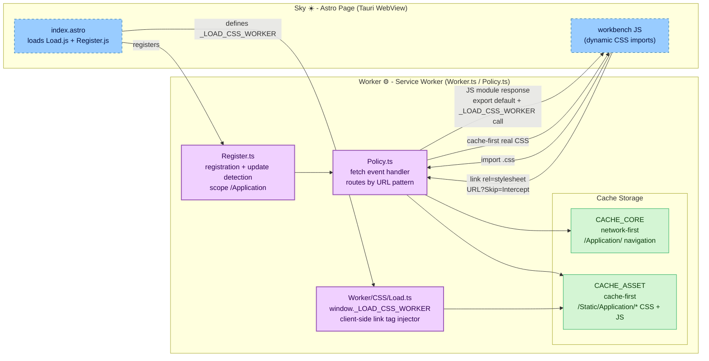

# **Worker**&#x2001;⚙️

<table>
	<tr>
		<td>
			<a href="https://GitHub.Com/CodeEditorLand/Worker" target="_blank">
				<picture>
					<source media="(prefers-color-scheme: dark)" srcset="https://img.shields.io/github/last-commit/CodeEditorLand/Worker?label=Last-commit&color=black&labelColor=black&logoColor=white&logoWidth=0" />
					<source media="(prefers-color-scheme: light)" srcset="https://img.shields.io/github/last-commit/CodeEditorLand/Worker?label=Last-commit&color=white&labelColor=white&logoColor=black&logoWidth=0" />
					
				</picture>
			</a>
			<br />
			<a href="https://GitHub.Com/CodeEditorLand/Worker" target="_blank">
				<picture>
					<source media="(prefers-color-scheme: dark)" srcset="https://img.shields.io/github/issues/CodeEditorLand/Worker?label=Issues&color=black&labelColor=black&logoColor=white&logoWidth=0" />
					<source media="(prefers-color-scheme: light)" srcset="https://img.shields.io/github/issues/CodeEditorLand/Worker?label=Issues&color=white&labelColor=white&logoColor=black&logoWidth=0" />
					
				</picture>
			</a>
		</td>
		<td>
			<a href="https://github.com/CodeEditorLand/Worker" target="_blank">
				<picture>
					<source media="(prefers-color-scheme: dark)" srcset="https://img.shields.io/github/stars/CodeEditorLand/Worker?style=flat&label=Star&logo=github&color=black&labelColor=black&logoColor=white&logoWidth=0" />
					<source media="(prefers-color-scheme: light)" srcset="https://img.shields.io/github/stars/CodeEditorLand/Worker?style=flat&label=Star&logo=github&color=white&labelColor=white&logoColor=black&logoWidth=0" />
					
				</picture>
			</a>
			<br />
			<a href="https://GitHub.Com/CodeEditorLand/Worker" target="_blank">
				<picture>
					<source media="(prefers-color-scheme: dark)" srcset="https://img.shields.io/github/downloads/CodeEditorLand/Worker?label=Downloads&color=black&labelColor=black&logoColor=white&logoWidth=0" />
					<source media="(prefers-color-scheme: light)" srcset="https://img.shields.io/github/downloads/CodeEditorLand/Worker?label=Downloads&color=white&labelColor=white&logoColor=black&logoWidth=0" />
					
				</picture>
			</a>
		</td>
	</tr>
</table>

The Service Worker for Land - asset caching, offline support, and dynamic CSS
loading.

> **Web applications that lose authentication state on network drops force users
> to re-authenticate. Tokens stored in plaintext are accessible to any script
> running on the page.**

_"Offline-capable. Auth tokens encrypted. Auto-refreshed."_

[](https://github.com/CodeEditorLand/Worker/tree/Current/LICENSE)
[](https://www.npmjs.com/package/@codeeditorland/worker)

---

## Overview

`Worker` is the Service Worker for the **Land Code Editor** that enhances web
application performance and reliability through advanced caching, offline
support, and a unique strategy for handling dynamic CSS imports from JavaScript
modules.

It is engineered to:

1. **Implement Asset Caching** - Multiple caching strategies including
   network-first for navigation and cache-first for static assets.
2. **Enable Offline Support** - Allow the application shell and cached assets to
   function without network connectivity.
3. **Handle Dynamic CSS Loading** - Intercept JavaScript CSS imports and respond
   with JavaScript modules that trigger standard `<link>` tag loading.
4. **Support Automatic Updates** - Detect new Service Worker versions and prompt
   clients to reload for seamless updates.

---

## Architecture

`Worker` operates as a service worker registered from the Astro page (`Sky`),
intercepting fetch events to route requests through policy-based caching
strategies.



---

## Key Components

| Component    | Path                            | Description                                                         |
| ------------ | ------------------------------- | ------------------------------------------------------------------- |
| Worker Entry | `Source/Worker.ts`              | Service worker entry: caching strategies, interception logic        |
| Policy       | `Source/Worker/Policy.ts`       | Cache policies (network-first, cache-first, stale-while-revalidate) |
| Register     | `Source/Worker/Register.ts`     | Service worker registration, update detection, activation           |
| CSS Loader   | `Source/Worker/CSS/Load.ts`     | Client-side CSS loader (`window._LOAD_CSS_WORKER`)                  |
| Config       | `Source/Configuration/ESBuild/` | ESBuild build configuration and target definitions                  |
| Telemetry    | `Source/Telemetry/Bridge.ts`    | PostHog telemetry bridge for worker-level error reporting           |
| Build        | `Source/prepublishOnly.sh`      | Build orchestration script                                          |
| Dev          | `Source/Run.sh`                 | Development watch mode                                              |

### Project Structure

```
Worker/
├── Source/
│   ├── Worker.ts                # Service worker entry: caching strategies, interception logic
│   ├── Worker/
│   │   ├── Policy.ts            # Cache policies (network-first, cache-first, stale-while-revalidate)
│   │   ├── Register.ts          # Service worker registration, update detection, activation
│   │   └── CSS/
│   │       └── Load.ts          # Client-side CSS loader (window._LOAD_CSS_WORKER)
│   ├── Configuration/
│   │   └── ESBuild/             # ESBuild build configuration and target definitions
│   ├── Telemetry/
│   │   └── Bridge.ts            # PostHog telemetry bridge for worker-level error reporting
│   ├── prepublishOnly.sh        # Build orchestration script
│   └── Run.sh                   # Development watch mode
```

### Key Features

| Feature                         | Description                                                                                                           |
| :------------------------------ | :-------------------------------------------------------------------------------------------------------------------- |
| **Core Cache (`CACHE_CORE`)**   | Network-first for navigation requests; pre-caches essential assets on install                                         |
| **Asset Cache (`CACHE_ASSET`)** | Cache-first for static assets (`/Static/Application/*`); stores JS, images, CSS, and dynamically generated JS modules |
| **Offline Support**             | Leverages both caches to serve the application shell and cached assets offline                                        |
| **Dynamic CSS Loading**         | Intercepts `import .css` and responds with JS module that triggers `<link>` loading via `?Skip=Intercept`             |
| **Automatic Updates**           | Detects new SW versions and prompts clients to reload via `Register.js`                                               |

---

## In the Land Project

`Worker` is registered from the `Sky` Astro page and intercepts fetch events
within the Tauri WebView to cache static assets and handle dynamic CSS imports.

- **Depends on:** `Sky` (registers the service worker), `Wind` (indirectly via
  the page context)
- **Consumed by:** End users (caching/offline experience), `Sky` (dynamic CSS
  loading)
- **Protocol:** Service Worker API (`self.addEventListener('fetch')`,
  `Cache Storage`)

---

## Getting Started

`Worker` is built as part of the main **Land** project. Build instructions are
documented in
[`Documentation/GitHub/Building.md`](https://github.com/CodeEditorLand/Land/tree/Current/Documentation/GitHub/Building.md).

---

## Dynamic CSS Loading - Details

This worker implements a specific strategy to handle dynamic CSS imports from
JavaScript modules (e.g., `import './some-styles.css';`) located under
`/Static/Application/`.

**The Workflow:**

1. **Initial JS Import** - A JS module attempts to `import` a CSS file under
   `/Static/Application/`.
2. **Service Worker Intercept #1** - The `fetch` listener intercepts the
   request. Because the URL matches `/Static/Application/*.css` and lacks
   `?Skip=Intercept`, it proceeds with the CSS handling logic.
3. **Service Worker Responds with JS** - The worker responds with a dynamically
   generated JavaScript module:
    ```javascript
    window._LOAD_CSS_WORKER("/Static/Application/CodeEditorLand/component.css");
    export default {};
    ```
    This JS response is cached in `CACHE_ASSET` using the original CSS URL as
    the key.
4. **Browser Executes JS** - The browser executes this module.
   `export default {}` satisfies the `import` statement.
5. **Client Function Call** - `window._LOAD_CSS_WORKER` is called (defined in
   `Load.js`).
6. **Client Modifies URL & Creates `<link>`** - The function appends
   `?Skip=Intercept` to the CSS URL and creates a standard
   `<link rel="stylesheet">` tag in `<head>`.
7. **Browser Fetches CSS** - The browser initiates a second fetch with
   `?Skip=Intercept`.
8. **Service Worker Intercept #2** - The worker detects `?Skip=Intercept`,
   bypasses JS generation, and serves the actual CSS via cache-first strategy.
9. **Browser Applies Styles** - The browser receives and applies the real CSS
   (`Content-Type: text/css`).

This two-step fetch process, distinguished by the `?Skip=Intercept` parameter,
allows the initial JavaScript import to resolve quickly while triggering the
standard browser mechanism for loading actual CSS without infinite interception
loops.

### HTML Integration Example

```html
<!DOCTYPE html>
<html lang="en">
	<head>
		<!-- Load the CSS Loader script EARLY -->
		<script src="/Worker/CSS/Load.js" type="module"></script>

		<!-- Set the path to the Service Worker file -->
		<script>
			window._WORKER = "/Worker.js";
		</script>

		<!-- Register the Service Worker -->
		<script src="/Worker/Register.js" type="module"></script>
	</head>

	<body>
		<!-- Load main application script LAST -->
		<script src="/scripts/main-app.js" type="module"></script>
	</body>
</html>
```

---

## API Reference

- [Policy.ts](https://github.com/CodeEditorLand/Worker/tree/Current/Source/Worker/Policy.ts)
    - Main service worker with caching strategies
- [Register.ts](https://github.com/CodeEditorLand/Worker/tree/Current/Source/Worker/Register.ts)
    - Service worker registration and update handling
- [Load.ts](https://github.com/CodeEditorLand/Worker/tree/Current/Source/Worker/CSS/Load.ts)
    - Client-side CSS loader function (`window._LOAD_CSS_WORKER`)

---

## Related Documentation

- [Architecture Overview](https://Editor.Land/Doc/architecture) - Internal
  module structure
- [Land Documentation](../../Documentation/GitHub/README.md) - Complete
  documentation index
- [Wind 🌬️](https://github.com/CodeEditorLand/Wind) - Service layer (correlated
  frontend element)
- [Sky ☀️](https://github.com/CodeEditorLand/Sky) - UI component layer that
  registers Worker
- [Cocoon 🦋](https://github.com/CodeEditorLand/Cocoon) - Extension host sidecar
  (correlated frontend element)

---

## License

This project is released into the public domain under the **Creative Commons CC0
Universal** license. You are free to use, modify, distribute, and build upon
this work for any purpose, without any restrictions. For the full legal text,
see the
[`LICENSE`](https://github.com/CodeEditorLand/Worker/tree/Current/LICENSE) file.

---

## Changelog

See
[`CHANGELOG.md`](https://github.com/CodeEditorLand/Worker/tree/Current/CHANGELOG.md)
for a history of changes specific to **Worker** ⚙️.

---

## Funding

This project is funded through
[NGI0 Commons Fund](https://NLnet.NL/commonsfund), a fund established by
[NLnet](https://NLnet.NL) with financial support from the European Commission's
Next Generation Internet program, under grant agreement No 101135429.

<table>
	<tbody>
		<tr>
			<td align="left" valign="middle">
				<a href="https://Editor.Land">
					
				</a>
			</td>
			<td align="left" valign="middle">
				<a href="https://PlayForm.Cloud">
					
				</a>
			</td>
			<td align="left" valign="middle">
				<a href="https://NLnet.NL">
					
				</a>
			</td>
			<td align="left" valign="middle">
				<a href="https://NLnet.NL/commonsfund">
					
				</a>
			</td>
		</tr>
	</tbody>
</table>

---

**Project Maintainers**: Source Open
([Source/Open@editor.land](mailto:Source/Open@editor.land)) |
[GitHub Repository](https://github.com/CodeEditorLand/Worker) |
[Report an Issue](https://github.com/CodeEditorLand/Worker/issues) |
[Security Policy](https://github.com/CodeEditorLand/Worker/security/policy)
