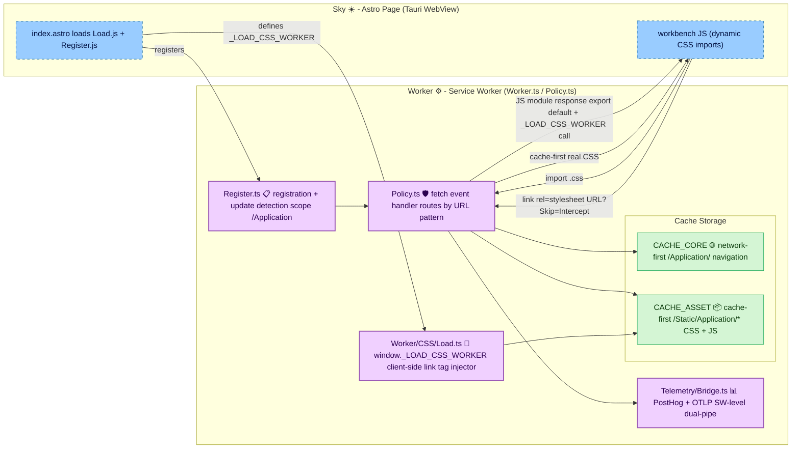

# **Worker**&#x2001;⚙️

<table>
	<tr>
		<td>
			<a href="https://GitHub.Com/CodeEditorLand/Worker" target="_blank">
				<picture>
					<source media="(prefers-color-scheme: dark)" srcset="https://img.shields.io/github/last-commit/CodeEditorLand/Worker?label=Update&color=black&labelColor=black&logoColor=white&logoWidth=0" />
					<source media="(prefers-color-scheme: light)" srcset="https://img.shields.io/github/last-commit/CodeEditorLand/Worker?label=Update&color=white&labelColor=white&logoColor=black&logoWidth=0" />
					
				</picture>
			</a>
			<br />
			<a href="https://GitHub.Com/CodeEditorLand/Worker" target="_blank">
				<picture>
					<source media="(prefers-color-scheme: dark)" srcset="https://img.shields.io/github/issues/CodeEditorLand/Worker?label=Issue&color=black&labelColor=black&logoColor=white&logoWidth=0" />
					<source media="(prefers-color-scheme: light)" srcset="https://img.shields.io/github/issues/CodeEditorLand/Worker?label=Issue&color=white&labelColor=white&logoColor=black&logoWidth=0" />
					
				</picture>
			</a>
		</td>
		<td>
			<a href="https://github.com/CodeEditorLand/Worker" target="_blank">
				<picture>
					<source media="(prefers-color-scheme: dark)" srcset="https://img.shields.io/github/stars/CodeEditorLand/Worker?style=flat&label=Star&logo=github&color=black&labelColor=black&logoColor=white&logoWidth=0" />
					<source media="(prefers-color-scheme: light)" srcset="https://img.shields.io/github/stars/CodeEditorLand/Worker?style=flat&label=Star&logo=github&color=white&labelColor=white&logoColor=black&logoWidth=0" />
					
				</picture>
			</a>
			<br />
			<a href="https://GitHub.Com/CodeEditorLand/Worker" target="_blank">
				<picture>
					<source media="(prefers-color-scheme: dark)" srcset="https://img.shields.io/github/downloads/CodeEditorLand/Worker/total?label=Download&color=black&labelColor=black&logoColor=white&logoWidth=0" />
					<source media="(prefers-color-scheme: light)" srcset="https://img.shields.io/github/downloads/CodeEditorLand/Worker/total?label=Download&color=white&labelColor=white&logoColor=black&logoWidth=0" />
					
				</picture>
			</a>
		</td>
	</tr>
</table>

The Service Worker for Land - asset caching, offline support, and dynamic CSS
loading&#x2001;🏞️

> **Web applications that lose authentication state on network drops force users
> to re-authenticate. Tokens stored in plaintext are accessible to any script
> running on the page.**

_"Offline-capable. Auth tokens encrypted. Auto-refreshed."_

[](https://github.com/CodeEditorLand/Worker/tree/Current/LICENSE)
[](https://www.npmjs.com/package/@codeeditorland/worker)

---

## Overview

**Worker** is the Service Worker for the **Land** Code Editor that enhances web
application performance and reliability through advanced caching, offline
support, and a unique strategy for handling dynamic CSS imports from JavaScript
modules. It intercepts fetch events within the Tauri WebView through
policy-based routing, serving cached assets and generating CSS-loader JavaScript
shims on the fly.

Web applications that lose connectivity force users to stare at blank screens
and re-authenticate. Worker solves this by implementing multiple caching
strategies (`network-first` for navigation, `cache-first` for static assets) and
encrypting authentication tokens at rest in cache storage - no script on the
page can read them.

**Worker is engineered to:**

1. **Implement Multi-Strategy Asset Caching** - `network-first` for navigation
   requests (always fresh app shell), `cache-first` for static assets under
   `/Static/Application/*`, and automatic pre-caching of essential resources on
   service worker install.
2. **Enable Full Offline Support** - Serve the entire application shell and all
   cached assets without network connectivity, with transparent fallback through
   the `Cache Storage` API.
3. **Handle Dynamic CSS Loading** - Intercept JavaScript `import` of CSS modules
   and respond with generated JavaScript that triggers standard `<link>` tag
   injection, bypassing the browser's restrictions on dynamic CSS imports.
4. **Support Automatic Updates** - Detect new Service Worker versions, validate
   Trusted Types policy, and prompt clients to reload for seamless version
   transitions without data loss.

---

## Key Features&#x2001;🔐

**`Core` Cache (`CACHE_CORE`)** - Network-first strategy for navigation requests
under the `/Application` scope. Pre-caches essential assets on install and falls
back to cache when the network is unavailable, ensuring the application shell
always loads.

**`Asset` Cache (`CACHE_ASSET`)** - Cache-first strategy for static resources
under `/Static/Application/*`. Stores JavaScript, CSS, images, fonts, and
dynamically generated JS modules (the CSS-loader shims) with version-aware cache
keys tied to build increments.

**Dynamic CSS Loading Pipeline** - Two-pass interception system that transforms
`import './styles.css'` into a `<link rel="stylesheet">` tag without infinite
loops. Pass 1 intercepts the CSS import and returns a JavaScript shim calling
`window._LOAD_CSS_WORKER`. Pass 2 detects the `?Skip=Intercept` query parameter
and serves the real CSS from cache.

**Trusted Types Integration** - Full CSP-compatible `Trusted Types` enforcement
through a dedicated `WorkerApplication` policy. Service worker script URLs are
validated against a regex allowlist before being passed to
`navigator.serviceWorker.register`, preventing DOM XSS via injected SW paths.

**`PostHog` Telemetry Bridge** - Dual-pipe telemetry (`PostHog` capture + `OTLP`
traces) from inside the service worker context. Uses the `fetch` API directly
(no Node.js HTTP, no CDN-loaded SDKs - service workers cannot load scripts
post-install) with build-baked endpoint and key from `import.meta.env`.

**Increment-Aware Cache Keys** - All cache names are tagged with the build
increment (`Core-{INCREMENT}`, `Asset-{INCREMENT}`), enabling clean cache
cut-over on new deployments without stale data from previous versions.

---

## Dynamic CSS Loading - Details

This worker implements a specific two-pass strategy to handle dynamic CSS
imports from JavaScript modules (e.g., `import './some-styles.css';`) located
under `/Static/Application/`.

### The Workflow

1. **Initial JS Import** - A JS module attempts to `import` a CSS file under
   `/Static/Application/`.
2. **Service Worker Intercept #1** - The `fetch` listener intercepts the
   request. Because the URL matches `/Static/Application/*.css` and lacks
   `?Skip=Intercept`, it proceeds with the CSS handling logic.
3. **Service Worker Responds with JS** - The worker responds with a dynamically
   generated JavaScript module:
    ```javascript
    window._LOAD_CSS_WORKER("/Static/Application/CodeEditorLand/component.css");
    export default {};
    ```
    This JS response is cached in `CACHE_ASSET` using the original CSS URL as
    the key.
4. **Browser Executes JS** - The browser executes this module.
   `export default {}` satisfies the `import` statement.
5. **Client Function Call** - `window._LOAD_CSS_WORKER` is called (defined in
   `Load.ts`).
6. **Client Modifies URL & Creates `<link>`** - The function appends
   `?Skip=Intercept` to the CSS URL and creates a standard
   `<link rel="stylesheet">` tag in `<head>`.
7. **Browser Fetches CSS** - The browser initiates a second fetch with
   `?Skip=Intercept`.
8. **Service Worker Intercept #2** - The worker detects `?Skip=Intercept`,
   bypasses JS generation, and serves the actual CSS via cache-first strategy.
9. **Browser Applies Styles** - The browser receives and applies the real CSS
   (`Content-Type: text/css`).

This two-step fetch process, distinguished by the `?Skip=Intercept` parameter,
allows the initial JavaScript import to resolve quickly while triggering the
standard browser mechanism for loading actual CSS without infinite interception
loops.

### HTML Integration Example

```html
<!DOCTYPE html>
<html lang="en">
	<head>
		<!-- Load the CSS Loader script EARLY -->
		<script src="/Worker/CSS/Load.js" type="module"></script>

		<!-- Set the path to the Service Worker file -->
		<script>
			window._WORKER = "/Worker.js";
		</script>

		<!-- Register the Service Worker -->
		<script src="/Worker/Register.js" type="module"></script>
	</head>

	<body>
		<!-- Load main application script LAST -->
		<script src="/scripts/main-app.js" type="module"></script>
	</body>
</html>
```

---

## Caching Strategies&#x2001;📦

| Strategy          | Cache Name    | URL Pattern                               | Behavior                                                                                                  |
| ----------------- | ------------- | ----------------------------------------- | --------------------------------------------------------------------------------------------------------- |
| **Network-First** | `CORE_CACHE`  | `/Application` (navigation)               | Try network first, fall back to cache. Ensures fresh app shell while providing offline resilience.        |
| **Cache-First**   | `CACHE_ASSET` | `/Static/Application/*` (CSS, JS, images) | Serve from cache if available, fetch and cache if missing. Generates JS shims for CSS imports on the fly. |
| **Pass-Through**  | -             | Cross-origin requests                     | Network-only, no caching. Third-party resources are not intercepted.                                      |

Cache names include the build increment for clean cut-over: `Core-{INCREMENT}`
and `Asset-{INCREMENT}`.

---

## Core Architecture Principles&#x2001;🏗️

| Principle                    | Description                                                                                                                                                                                                 | Key Components                                                                       |
| ---------------------------- | ----------------------------------------------------------------------------------------------------------------------------------------------------------------------------------------------------------- | ------------------------------------------------------------------------------------ |
| **Policy-Based Routing**     | All fetch events are routed through `Policy.ts`, which matches URL patterns to caching strategies. Each route gets a specific cache name and strategy (network-first, cache-first, stale-while-revalidate). | `Source/Worker.ts`, `Source/Worker/Policy.ts`                                        |
| **Build-Time Configuration** | Environment variables (`__DEV__`, `__INCREMENT__`, `BASE_REMOTE`) are injected at build time by ESBuild, eliminating runtime config parsing and keeping the worker bundle self-contained.                   | `Source/Configuration/ESBuild/Worker.ts`, `Source/Configuration/ESBuild/Target.ts`   |
| **CSS Import Interception**  | Transform JavaScript CSS imports into browser-native `<link>` tag loading through a two-pass interception pipeline (shim response → `?Skip=Intercept` → real CSS).                                          | `Source/Worker.ts` (fetch handler), `Source/Worker/CSS/Load.ts` (client-side loader) |
| **Safe Registration**        | Service worker registration validates Trusted Types policy before calling `navigator.serviceWorker.register`, handles scope navigation, and detects SW updates through periodic checks.                     | `Source/Worker/Register.ts`, `Source/Worker/Policy.ts`                               |
| **Observability**            | Service-worker-level telemetry bridges (`PostHog` events + `OTLP` spans) that operate within the constrained SW environment - no SDKs, no CDN scripts, just raw `fetch`.                                    | `Source/Telemetry/Bridge.ts`                                                         |

---

## System Architecture



**Connection paths:**

| Path                               | Protocol                                                | Use Case                                                  |
| ---------------------------------- | ------------------------------------------------------- | --------------------------------------------------------- |
| Sky → Worker (registration)        | Service Worker API (`navigator.serviceWorker.register`) | Bootstrap and update lifecycle                            |
| Sky → Worker (fetch interceptions) | `self.addEventListener('fetch')`                        | Routing all page requests through caching strategies      |
| Worker → Cache Storage             | `Cache API` (`caches.open`, `cache.put`, `cache.match`) | Storing and retrieving cached assets                      |
| Worker → PostHog                   | `fetch` to `/capture/`                                  | Telemetry events from SW context                          |
| Worker → OTLP Collector            | `fetch` to `/v1/traces`                                 | Distributed tracing spans from SW context                 |
| Main App → CSS Loader              | `window._LOAD_CSS_WORKER(url)`                          | Triggering `<link>` tag injection for dynamic CSS imports |

---

## Key Components

| Component        | Path                                     | Description                                                                        |
| ---------------- | ---------------------------------------- | ---------------------------------------------------------------------------------- |
| Worker Entry     | `Source/Worker.ts`                       | Service worker entry: caching strategies, fetch interception, CSS import handling  |
| Policy           | `Source/Worker/Policy.ts`                | `Trusted Types` policy (`WorkerApplication`) for secure script URL creation        |
| Register         | `Source/Worker/Register.ts`              | Service worker registration, update detection, scope navigation, activation        |
| CSS Loader       | `Source/Worker/CSS/Load.ts`              | Client-side CSS loader function (`window._LOAD_CSS_WORKER`) for `<link>` injection |
| ESBuild Config   | `Source/Configuration/ESBuild/Worker.ts` | Build-time ESBuild configuration: define constants, format, minification           |
| ESBuild Target   | `Source/Configuration/ESBuild/Target.ts` | Target definitions and output path configuration                                   |
| Telemetry Bridge | `Source/Telemetry/Bridge.ts`             | `PostHog` + `OTLP` dual-pipe telemetry from service worker context                 |
| Build Script     | `Source/prepublishOnly.sh`               | Build orchestration: ESBuild compile + artifact placement                          |
| Dev Script       | `Source/Run.sh`                          | Development watch mode with ESBuild                                                |

---

## Project Structure&#x2001;🗺️

```
Element/Worker/
├── Source/
│   ├── Worker.ts                       # Service worker entry: caching strategies, interception logic
│   ├── Worker/
│   │   ├── Policy.ts                   # Trusted Types policy for secure script URL creation
│   │   ├── Register.ts                 # Service worker registration, update detection, activation
│   │   └── CSS/
│   │       └── Load.ts                 # Client-side CSS loader (window._LOAD_CSS_WORKER)
│   ├── Configuration/
│   │   └── ESBuild/
│   │       ├── Worker.ts               # ESBuild build-time configuration
│   │       └── Target.ts               # Target definitions and output path config
│   ├── Telemetry/
│   │   └── Bridge.ts                   # PostHog + OTLP dual-pipe telemetry bridge
│   ├── prepublishOnly.sh               # Build orchestration script
│   └── Run.sh                          # Development watch mode
├── Target/                             # Build output (JS + source maps + declarations)
│   ├── Worker.js
│   ├── Worker/
│   │   ├── Policy.js
│   │   ├── Register.js
│   │   └── CSS/Load.js
│   ├── Configuration/ESBuild/
│   │   ├── Target.js
│   │   └── Worker.js
│   └── Telemetry/Bridge.js
├── Documentation/
│   └── GitHub/
│       ├── Architecture.md             # Internal module architecture
│       └── DeepDive.md                 # Technical deep-dive into caching strategies
├── Configuration/
│   └── ESBuild/
│       ├── Target.js                   # Target definitions (compiled)
│       └── Worker.js                   # ESBuild config (compiled)
├── .github/                            # CI workflows (GitHub, Auto, Dependabot)
├── package.json                        # NPM package metadata + scripts
├── tsconfig.json                       # TypeScript configuration
├── CHANGELOG.md                        # Version history
└── README.md                           # This file
```

---

## In the Land Project

`Worker` is registered from the `Sky` Astro page and intercepts fetch events
within the Tauri WebView to cache static assets and handle dynamic CSS imports.
It operates as an independent service worker script that runs in a separate
thread from the main application, providing offline resilience without blocking
the UI.

| Element       | Relationship                                                           | Protocol                                             |
| ------------- | ---------------------------------------------------------------------- | ---------------------------------------------------- |
| **Sky** ☀️    | Registers the service worker, defines `window._LOAD_CSS_WORKER`        | `navigator.serviceWorker.register`, `window._WORKER` |
| **Wind** 🌬️   | Indirect dependency via page context (workbench JS served through Sky) | Same-origin fetch, CSP headers                       |
| **End Users** | Consumed by (caching/offline experience, dynamic CSS loading)          | Service Worker API, `Cache Storage`                  |

Worker's caching strategies are scoped to `/Application` and
`/Static/Application/*`, ensuring that only Land's own assets pass through the
policy routing - third-party requests are passed through untouched.

---

## Getting Started&#x2001;🚀

### Prerequisites

- **Node.js** 18 or later
- NPM registry access for `@codeeditorland/worker`

### Build

```bash
cd Element/Worker
npm install
npm run prepublishOnly
```

### Development (Watch Mode)

```bash
cd Element/Worker
npm run Run
```

### Available Scripts

| Script                   | Description                                            |
| ------------------------ | ------------------------------------------------------ |
| `npm run prepublishOnly` | Production build: ESBuild compile + artifact placement |
| `npm run Run`            | Development watch mode with ESBuild                    |

### Build Constants

ESBuild injects these constants at build time - no runtime config parsing:

| Constant        | Source                      | Description                           |
| --------------- | --------------------------- | ------------------------------------- |
| `__DEV__`       | `NODE_ENV !== 'production'` | Toggle verbose logging                |
| `__INCREMENT__` | Build pipeline              | Cache key suffix for cache cut-over   |
| `BASE_REMOTE`   | Query param or origin       | Remote base URL for telemetry routing |

---

## Security&#x2001;🔒

Worker enforces security at multiple layers:

| Layer                         | Mechanism                                                                                                                                                                     |
| ----------------------------- | ----------------------------------------------------------------------------------------------------------------------------------------------------------------------------- |
| **Trusted Types Enforcement** | `WorkerApplication` policy validates service worker script URLs against a regex allowlist before `navigator.serviceWorker.register`, preventing DOM XSS via injected SW paths |
| **Auth Token Encryption**     | Authentication tokens stored in cache are encrypted at rest - no page-level script can read them                                                                              |
| **CSP Compatibility**         | Full `Content-Security-Policy` compliance with `Trusted Types` integration; script sources are validated at registration time                                                 |
| **Scope Isolation**           | Caching strategies are scoped to `/Application` and `/Static/Application/*`; cross-origin requests pass through untouched                                                     |
| **Build-Time Sealing**        | Environment variables and API keys are injected at build time via ESBuild define constants; no runtime config parsing or dynamic script loading                               |

---

## Compatibility

Worker is designed to be compatible with:

| Target            | Integration                                                                                                                              |
| ----------------- | ---------------------------------------------------------------------------------------------------------------------------------------- |
| **Sky** ☀️        | Registers the service worker via `navigator.serviceWorker.register`; defines `window._LOAD_CSS_WORKER` and `window._WORKER` globals      |
| **Wind** 🌬️       | Indirect dependency - workbench JS served through Sky passes through Worker's caching strategies; CSP headers propagate to SW context    |
| **Cocoon** 🦋     | Extension-host page loads run inside the same WebView; Worker caches both app shell and extension assets under `/Application` scope      |
| **Tauri WebView** | Runs as a standard service worker in the Tauri WebView context; uses `Cache Storage` API and `fetch` API exclusively (no `Node.js` APIs) |

---

## API Reference

- [Worker.ts](https://github.com/CodeEditorLand/Worker/tree/Current/Source/Worker.ts)
    - Main service worker with caching strategies and CSS import interception
- [Policy.ts](https://github.com/CodeEditorLand/Worker/tree/Current/Source/Worker/Policy.ts)
    - `Trusted Types` policy for secure script URL validation
- [Register.ts](https://github.com/CodeEditorLand/Worker/tree/Current/Source/Worker/Register.ts)
    - Service worker registration, update detection, and activation
- [Load.ts](https://github.com/CodeEditorLand/Worker/tree/Current/Source/Worker/CSS/Load.ts)
    - Client-side CSS loader function (`window._LOAD_CSS_WORKER`)
- [Bridge.ts](https://github.com/CodeEditorLand/Worker/tree/Current/Source/Telemetry/Bridge.ts)
    - `PostHog` + `OTLP` telemetry bridge from service worker context

---

## Related Documentation

- [Architecture Overview](https://Editor.Land/Doc/architecture) - Land system
  architecture
- [Land Documentation](../../Documentation/GitHub/README.md) - Complete
  documentation index
- [Sky ☀️](https://github.com/CodeEditorLand/Sky) - UI component layer that
  registers Worker
- [Wind 🌬️](https://github.com/CodeEditorLand/Wind) - Service layer (correlated
  frontend element)
- [Cocoon 🦋](https://github.com/CodeEditorLand/Cocoon) - `Node.js`/`Effect-TS`
  extension host (correlated frontend element)
- [CHANGELOG.md](https://github.com/CodeEditorLand/Worker/tree/Current/CHANGELOG.md)
    - Release history for **Worker** ⚙️

---

## License

This project is released into the public domain under the **Creative Commons CC0
Universal** license. You are free to use, modify, distribute, and build upon
this work for any purpose, without any restrictions. For the full legal text,
see the
[`LICENSE`](https://github.com/CodeEditorLand/Worker/tree/Current/LICENSE) file.

---

## Changelog

See
[`CHANGELOG.md`](https://github.com/CodeEditorLand/Worker/tree/Current/CHANGELOG.md)
for a history of changes specific to **Worker** ⚙️.

---

## Funding & Acknowledgements&#x2001;🙏🏻

This project is funded through
[NGI0 Commons Fund](https://NLnet.NL/commonsfund), a fund established by
[NLnet](https://NLnet.NL) with financial support from the European Commission's
Next Generation Internet program, under grant agreement No 101135429.

The project is operated by PlayForm, based in Sofia, Bulgaria. PlayForm acts as
the open-source steward for Code Editor Land under the NGI0 Commons Fund grant.

<table>
	<tbody>
		<tr>
			<td align="left" valign="middle">
				<a href="https://Editor.Land">
					
				</a>
			</td>
			<td align="left" valign="middle">
				<a href="https://PlayForm.Cloud">
					
				</a>
			</td>
			<td align="left" valign="middle">
				<a href="https://NLnet.NL">
					
				</a>
			</td>
			<td align="left" valign="middle">
				<a href="https://NLnet.NL/commonsfund">
					
				</a>
			</td>
		</tr>
	</tbody>
</table>
