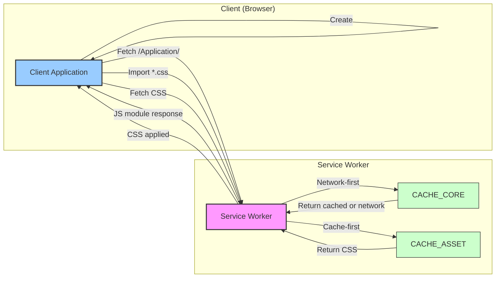

<table>
<tr>
<td align="left" valign="middle">
<h3 align="left"> Worker</h3>
</td>
<td align="left" valign="middle">
<h3 align="left">
🍩
</h3>
</td>
<td align="left" valign="middle">
<h3 align="left"> + </h3>
</td>
<td align="left" valign="middle">
<h3 align="left">
<a href="https://Editor.Land" target="_blank">
<picture>
<source media="(prefers-color-scheme: dark)" srcset="https://PlayForm.Cloud/Dark/Image/GitHub/Land.svg">
<source media="(prefers-color-scheme: light)" srcset="https://PlayForm.Cloud/Image/GitHub/Land.svg">

</picture>
</a>
</h3>
</td>
<td align="left" valign="middle">
<h3 align="left">
<a href="https://Editor.Land" target="_blank">
Land
</a>
</h3>
</td>
<td align="left" valign="middle">
<h3 align="left">
🏞️
</h3>
</td>
</tr>
</table>

---

# **Worker**&#x2001;🍩

> **Web applications that lose authentication state on network drops force users to re-authenticate. Tokens stored in plaintext are accessible to any script running on the page.**

_"Offline-capable. Auth tokens encrypted. Auto-refreshed."_

&#x2001;

The editor shell stays functional and authenticated even when the network drops. Auth tokens are AES-GCM encrypted, requests are HMAC-signed, and tokens refresh automatically without user action. Caching, offline support, and dynamic CSS imports all managed through the Service Worker layer.

---

## What It Does&#x2001;🔐

- **AES-GCM encrypted auth.** Tokens stored with hardware-backed encryption, not plaintext.
- **HMAC-signed requests.** Every request to backend Workers is cryptographically signed.
- **Auto token refresh.** Tokens refresh automatically without user interaction.
- **Offline support.** The editor shell works without a network connection.

---

## In the Ecosystem&#x2001;🍩 + 🏞️

---

## Development&#x2001;🛠️

Worker is a component of the Land workspace. Follow the
[Land Repository](https://github.com/CodeEditorLand/Land) instructions to
build and run.

---

## License&#x2001;⚖️

CC0 1.0 Universal. Public domain. No restrictions.
[LICENSE](https://github.com/CodeEditorLand/Worker/tree/Current/LICENSE)

---

## See Also

- [Worker Documentation](https://editor.land/Doc/worker)
- [Architecture Overview](https://editor.land/Doc/architecture)
- [Mountain](https://github.com/CodeEditorLand/Mountain)

## Funding & Acknowledgements 🙏🏻

Code Editor Land is funded through the NGI0 Commons Fund, established by NLnet
with financial support from the European Commission's Next Generation Internet
programme, under grant agreement No. 101135429.

The project is operated by PlayForm, based in Sofia, Bulgaria.

PlayForm acts as the open-source steward for Code Editor Land under the NGI0
Commons Fund grant.

<table>
	<thead>
		<tr>
			<th align="left"><strong>Land</strong></th>
			<th align="left"><strong>PlayForm</strong></th>
			<th align="left"><strong>NLnet</strong></th>
			<th align="left"><strong>NGI0 Commons Fund</strong></th>
		</tr>
	</thead>
	<tbody>
		<tr>
			<td align="left" valign="middle">
				
			</td>
			<td align="left" valign="middle">
				
			</td>
			<td align="left" valign="middle">
				
			</td>
			<td align="left" valign="middle">
				
			</td>
		</tr>
	</tbody>
</table>

---

**Project Maintainers**: Source Open
([Source/Open@Editor.Land](mailto:Source/Open@Editor.Land)) |
[GitHub Repository](https://github.com/CodeEditorLand/Worker) |
[Report an Issue](https://github.com/CodeEditorLand/Worker/issues) |
[Security Policy](https://github.com/CodeEditorLand/Worker/security/policy)
