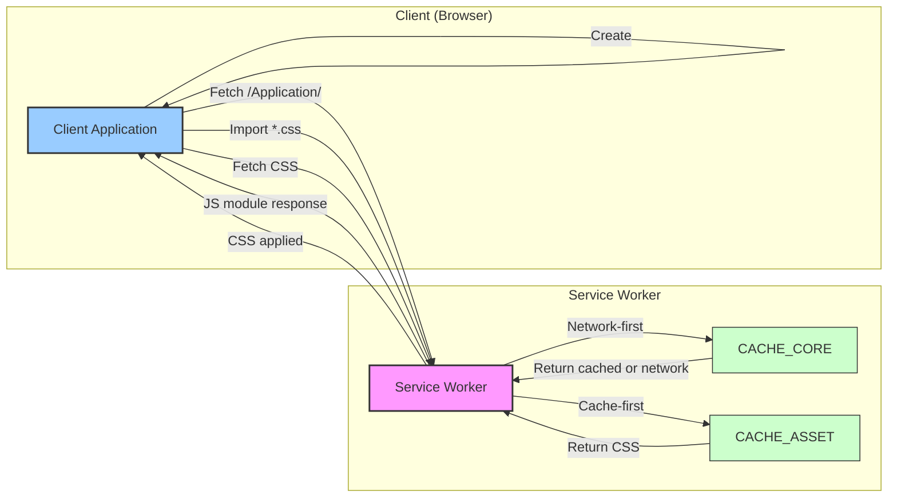

<table>
<tr>
<td align="left" valign="middle">
<h3 align="left"> Worker</h3>
</td>
<td align="left" valign="middle">
<h3 align="left">
🍩
</h3>
</td>
<td align="left" valign="middle">
<h3 align="left"> + </h3>
</td>
<td align="left" valign="middle">
<h3 align="left">
<a href="https://Editor.Land" target="_blank">
<picture>
<source media="(prefers-color-scheme: dark)" srcset="https://PlayForm.Cloud/Dark/Image/GitHub/Land.svg">
<source media="(prefers-color-scheme: light)" srcset="https://PlayForm.Cloud/Image/GitHub/Land.svg">

</picture>
</a>
</h3>
</td>
<td align="left" valign="middle">
<h3 align="left">
<a href="https://Editor.Land" target="_blank">
Land
</a>
</h3>
</td>
<td align="left" valign="middle">
<h3 align="left">
🏞️
</h3>
</td>
</tr>
</table>

---

# **Worker** 🍩

The Service Worker for Land 🏞️

[](https://github.com/CodeEditorLand/Worker/tree/Current/LICENSE)
[](https://www.npmjs.com/package/@codeeditorland/worker)

**Worker** is the Service Worker for the **Land Code Editor** that enhances web
application performance and reliability. It provides advanced caching, offline
support, and a unique strategy for handling dynamic CSS imports from JavaScript
modules.

**Worker** is engineered to:

1. **Implement Asset Caching:** Provide multiple caching strategies including
   network-first for navigation and cache-first for static assets.
2. **Enable Offline Support:** Allow the application shell and cached assets to
   function without network connectivity.
3. **Handle Dynamic CSS Loading:** Intercept JavaScript CSS imports and respond
   with JavaScript modules that trigger standard `<link>` tag loading.
4. **Support Automatic Updates:** Detect new Service Worker versions and prompt
   clients to reload for seamless updates.

---

## Key Features 🔐

- **Asset Caching:** Implements multiple caching strategies:
    - **Core Cache (`CACHE_CORE`):** Stores essential application shell files
      and critical scripts (like `/Application/`, `Register.js`, `Load.js`).
      Uses a **network-first** strategy for navigation requests, falling back to
      the cache when offline.
    - **Asset Cache (`CACHE_ASSET`):** Stores static application assets
      (`/Static/Application/*`), including JavaScript, images, and CSS files.
      Uses a **cache-first** strategy for fast loading. Also stores dynamically
      generated JavaScript modules used for CSS loading.
- **Offline Support:** Leverages the caches to allow the application shell and
  cached assets to function offline.
- **Dynamic CSS Loading:** Intercepts JavaScript `import` statements for
  specific CSS files and responds with a JavaScript module that triggers loading
  of the actual CSS via a standard `<link>` tag.
- **Automatic Updates:** Detects when a new version of the Service Worker is
  activated and prompts the client (via `Register.js`) to reload the page,
  ensuring seamless updates.
- **Client Control Management:** The `Register.js` script ensures the Service
  Worker gains control of the page, potentially reloading once after the initial
  registration.

---

## System Architecture Diagram 🏗️

This diagram illustrates `Worker`'s service worker caching and CSS loading
strategy.



---

## Usage: Dynamic CSS Loading via JS Module Response 🚀

This worker implements a specific strategy to handle dynamic CSS imports from
JavaScript modules (e.g., `import './some-styles.css';`) located under the
`/Static/Application/` path. Instead of relying on `postMessage` coordination,
it directly responds to the initial import request with JavaScript code that
initiates the standard browser CSS loading mechanism.

**The Workflow:**

1.  **Initial JS Import:** A JavaScript module in your application attempts to
    import a CSS file located under `/Static/Application/` (e.g.,
    `/Static/Application/CodeEditorLand/component.css`).
2.  **Service Worker Intercept #1:** The worker's `fetch` listener intercepts
    this request. Because the URL matches the pattern
    `/Static/Application/*.css` and _doesn't_ contain the special
    `?Skip=Intercept` parameter, it proceeds with the CSS handling logic.
3.  **Service Worker Responds with JS:** The worker _immediately_ responds to
    the fetch request with a dynamically generated JavaScript module
    (`Content-Type: application/javascript; charset=utf-8`). The content of this
    module is similar to:
    ```javascript
    window._LOAD_CSS_WORKER("/Static/Application/CodeEditorLand/component.css");
    export default {};
    ```
    This JavaScript response is then cached in `CACHE_ASSET` using the original
    CSS request URL as the key.
4.  **Browser Executes JS:** The browser receives and executes this JavaScript
    module. The `export default {};` satisfies the expectation of the original
    `import` statement.
5.  **Client Function Call:** The executed JavaScript calls the globally
    available `window._LOAD_CSS_WORKER` function (which must be defined
    beforehand by including `Load.js`).
6.  **Client Modifies URL & Creates `<link>`:** The `_LOAD_CSS_WORKER` function
    appends the `?Skip=Intercept` query parameter to the received CSS URL (e.g.,
    `/Static/Application/CodeEditorLand/component.css?Skip=Intercept`). It then
    creates a standard `<link rel="stylesheet">` tag, setting its `href` to this
    _modified_ URL, and appends it to the document's `<head>`.
7.  **Browser Fetches CSS:** The browser sees the new `<link>` tag and initiates
    a _second_ fetch request for the CSS file, this time using the URL _with_
    the `?Skip=Intercept` parameter.
8.  **Service Worker Intercept #2:** The worker intercepts this second request.
9.  **Service Worker Serves CSS:** The worker detects the `?Skip=Intercept`
    parameter. It bypasses the JS generation logic and proceeds to fetch the
    _actual_ CSS content using a **cache-first** strategy against `CACHE_ASSET`
    (looking for the URL _including_ the parameter in the cache, or fetching
    from the network). It responds with the real CSS content
    (`Content-Type: text/css`).
10. **Browser Applies Styles:** The browser receives the actual CSS and applies
    the styles as expected.

This two-step fetch process, initiated by the SW's JavaScript response and
distinguished by the `Skip=Intercept` parameter, allows the initial JavaScript
import to resolve quickly while triggering the standard browser mechanism for
loading CSS without causing infinite interception loops.

---

## Deep Dive & Component Breakdown 🔬

To understand how `Worker`'s service worker implements the dynamic CSS loading
strategy, see the following source files:

- **[`Worker.ts`](https://github.com/CodeEditorLand/Worker/tree/Current/Source/Worker/Worker.ts)**
  — Main service worker with caching strategies
- **[`Register.ts`](https://github.com/CodeEditorLand/Worker/tree/Current/Source/Worker/Register.ts)**
  — Service worker registration and update handling
- **[`Load.ts`](https://github.com/CodeEditorLand/Worker/tree/Current/Source/Worker/CSS/Load.ts)**
  — Client-side CSS loader function (`window._LOAD_CSS_WORKER`)

The source files explain the two-step fetch process, cache-first strategies for
assets, and the `?Skip=Intercept` parameter pattern for avoiding infinite loops.

---

### Example Implementation

This example shows how to integrate the necessary client-side scripts and
Service Worker registration within an HTML page (`.html` file).

**`index.html` (or your main layout/page):**

```html
<!DOCTYPE html>
<html lang="en">
	<head>
		<meta charset="utf-8" />
		<meta content="width=device-width, initial-scale=1.0" name="viewport" />
		<title>My App with Service Worker CSS Loading</title>

		<!-- Optional: Favicon, other meta tags -->
		<link href="/favicon.ico" rel="icon" />

		<!--
            IMPORTANT: Load the CSS Loader script EARLY.
            This script defines the global function window._LOAD_CSS_WORKER
            needed by the Service Worker's JS response.
            It needs to run before your main app script tries to import CSS.
        -->
		<script src="/Worker/CSS/Load.js" type="module"></script>

		<!--
            Define the path to the Service Worker file so Register.js can find it.
            This script block should come *before* Register.js.
            Ensure this path correctly points to where your Worker.js is served.
        -->
		<script>
			// Set the path relative to the web root where Worker.js will be served.
			// Default is "/Worker.js"
			window._WORKER = "/Worker.js";
		</script>

		<!--
            Register the Service Worker.
            This script handles registration, listens for updates from the SW
            (triggering reloads), and manages ensuring the SW controls the page.
            It uses the window._WORKER path defined above and registers with scope '/Application'.
        -->
		<script src="/Worker/Register.js" type="module"></script>

		<!-- Optional: Load any other critical CSS or JS needed before the main app -->
		<link href="/styles/base.css" rel="stylesheet" />
	</head>

	<body>
		<header>
			<h1>Application Header</h1>
		</header>

		<main>
			<p>Loading application...</p>

			<!-- Your main application might render into a specific div -->
			<div id="app-container"></div>
		</main>

		<footer>
			<p>Application Footer</p>
		</footer>

		<!--
            Load your main application script LAST.
            Any dynamic import '/Static/Application/some-component.css'
            inside this script or its dependencies will trigger the
            Service Worker interception and JS module response described above.
        -->
		<script src="/scripts/main-app.js" type="module"></script>
	</body>
</html>
```

[Worker]: https://NPMJS.Org/@codeeditorland/worker

---

## License ⚖️

This project is licensed under Creative Commons CC0.

See the LICENSE file for details.

---

## Changelog 📜

Stay updated with our progress! See
[`CHANGELOG.md`](https://github.com/CodeEditorLand/Worker/tree/Current/) for a
history of changes specific to **Worker**.

---


## See Also

- [Architecture Overview](https://editor.land/Doc/architecture)
- [Wind](https://github.com/CodeEditorLand/Wind)
- [Sky](https://github.com/CodeEditorLand/Sky)

## Funding & Acknowledgements 🙏🏻

Code Editor Land is funded through the NGI0 Commons Fund, established by NLnet
with financial support from the European Commission's Next Generation Internet
programme, under grant agreement No. 101135429.

The project is operated by PlayForm, based in Sofia, Bulgaria.

PlayForm acts as the open-source steward for Code Editor Land under the NGI0
Commons Fund grant.

<table>
	<thead>
		<tr>
			<th align="left"><strong>Land</strong></th>
			<th align="left"><strong>PlayForm</strong></th>
			<th align="left"><strong>NLnet</strong></th>
			<th align="left"><strong>NGI0 Commons Fund</strong></th>
		</tr>
	</thead>
	<tbody>
		<tr>
			<td align="left" valign="middle">
				<a href="https://Editor.Land">
					
				</a>
			</td>
			<td align="left" valign="middle">
				<a href="https://PlayForm.Cloud">
					
				</a>
			</td>
			<td align="left" valign="middle">
				<a href="https://NLnet.NL">
					
				</a>
			</td>
			<td align="left" valign="middle">
				<a href="https://NLnet.NL/commonsfund">
					
				</a>
			</td>
		</tr>
	</tbody>
</table>

---

**Project Maintainers**: Source Open
([Source/Open@Editor.Land](mailto:Source/Open@Editor.Land)) |
[GitHub Repository](https://github.com/CodeEditorLand/Worker) |
[Report an Issue](https://github.com/CodeEditorLand/Worker/issues) |
[Security Policy](https://github.com/CodeEditorLand/Worker/security/policy)
